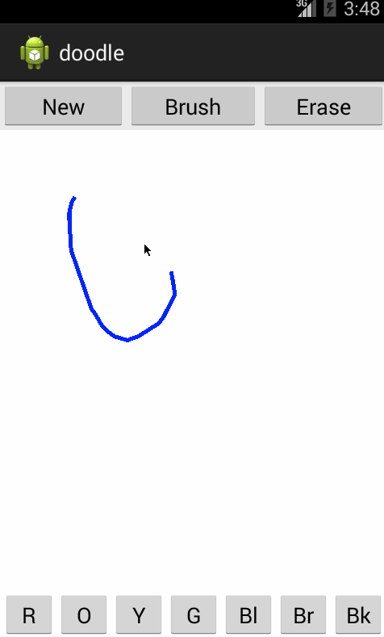

# Doodle / Paint
<i> Android Intermediate Class - Week 3 - Drawing with Views </i>

## Author
- David Victor

## User Stories
* User can press down to draw on the canvas.
* User can choose between at least 6 colors to draw with.
* User can choose between at least 3 different brush sizes.
* User can press "New" to clear the canvas and start over.
* <b>(Stretch)</b> User can erase parts of their drawing.

## Demo
 

## Reference
- [Assignment](https://yahoo.jiveon.com/docs/DOC-6520)
- [Basic Drawing With Views](http://guides.codepath.com/android/Basic-Painting-with-Views)
- [Defining Custom Views](http://guides.codepath.com/android/Defining-Custom-Views)
- [CodePath Custom Views Demo](https://github.com/thecodepath/android-custom-view-demos)
- [Dialog Fragment to Display Brush Sizes](http://guides.codepath.com/android/Using-DialogFragment)
- [Converting Between Pixels and Dp](https://github.com/thecodepath/android_guides/wiki/Basic-Painting-with-Views#drawing-with-density-independent-pixels)
